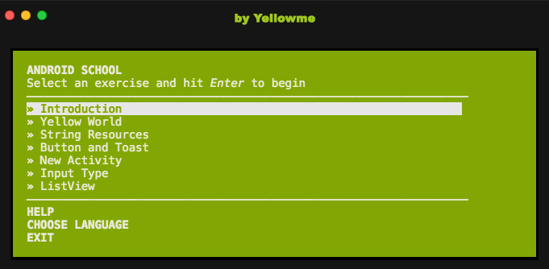

# Learn the android basics with **Android School Basics** For Much Win!

**Beta version**

**5 Exercises for now**

**An intro to Android via a set of self-guided exercise.**

[Gettin started with Android?](https://developer.android.com/training/index.html)

  1. Install [Node.js](http://nodejs.org/)
  2. Install [Git](https://git-scm.com/)
  3. Install [Android SDK](https://developer.android.com/studio/index.html?hl=es-419) with Android Studio 2.3 or higher version
  4. Run `npm install androidschoolbasics -g`
  * In case it fails, easiest way is to prefix with `sudo`:
        `sudo npm install -g androidschoolbasics` 
    - or to:
     [fix your npm permissions](https://docs.npmjs.com/getting-started/fixing-npm-permissions).
    * (Ubuntu users) run `sudo apt-get install nodejs-legacy`
  5. Clone the [repository](https://github.com/yellowme/androidschool) of the android project you're goin to use in android studio
  6. Run `androidbasics` inside the android project directory
  7. **Learn!**

<b><code>androidbasics</code></b> will run through a series of Android workshops. Starting at a basic *"HELLO WORLD"* and moving on to more basics exercises.

Once you have finished <b><code>androidbasics</code></b>, you can keep learning new stuff by yourself.

### Contributors

<b><code>androidbasics</code></b> is proudly brought to you by the following hackers:

<table><tbody>
<tr><th align="left">Kevin Gamboa</th><td><a href="https://github.com/kevingamboa17">GitHub/kevingamboa17</a></td><td><a href="http://twitter.com/kevingamboa17">Twitter/@kevingamboa17</a></td></tr>

</tbody></table>

### To-do

some of the things we need to do

<table><tbody>

<tr>
<th align="left">Logs</th>
<td><a>Erase some logs and controll them</a></td>

</tbody></table>
